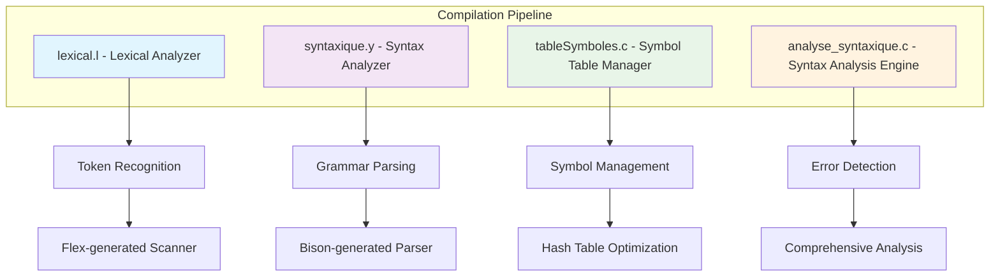
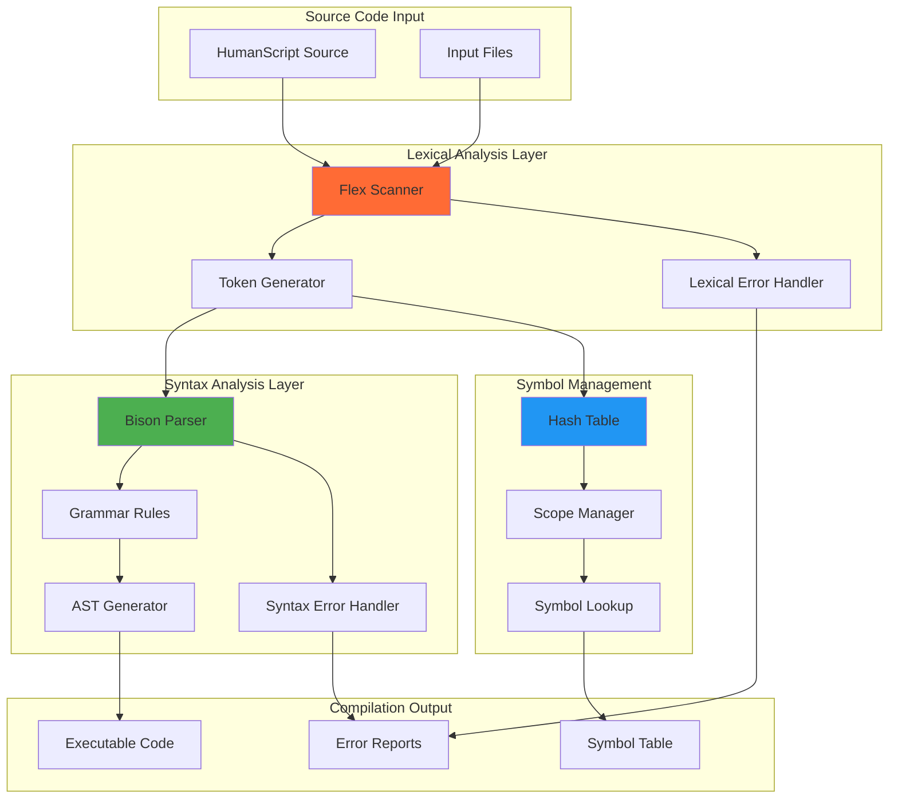
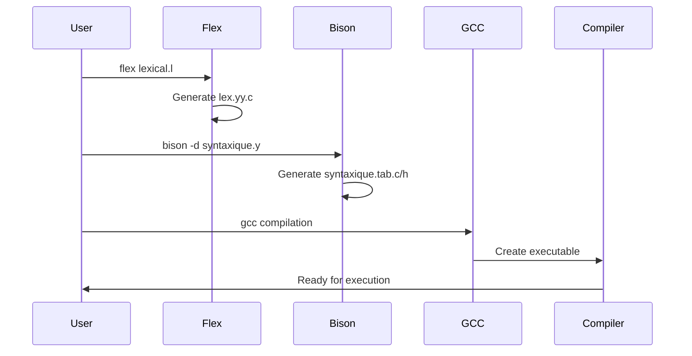
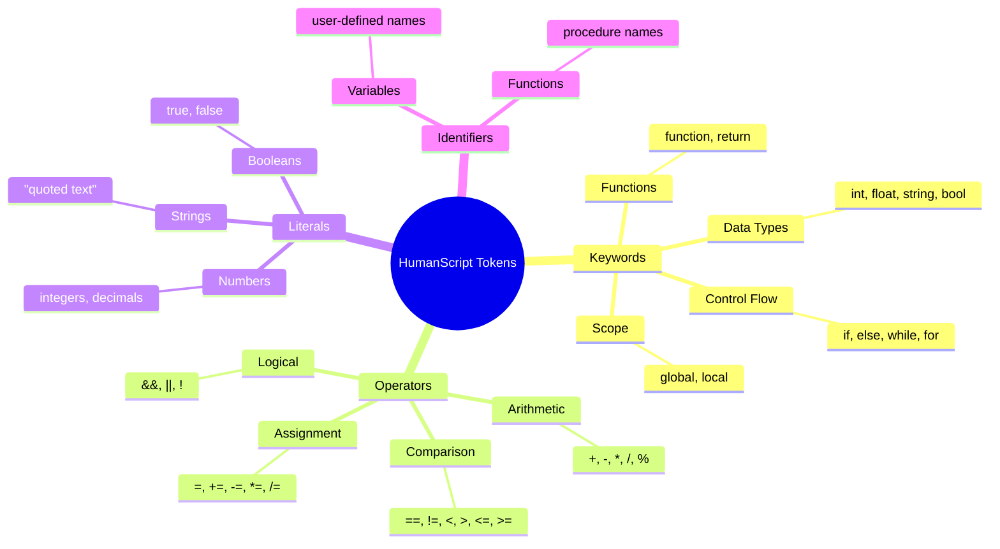
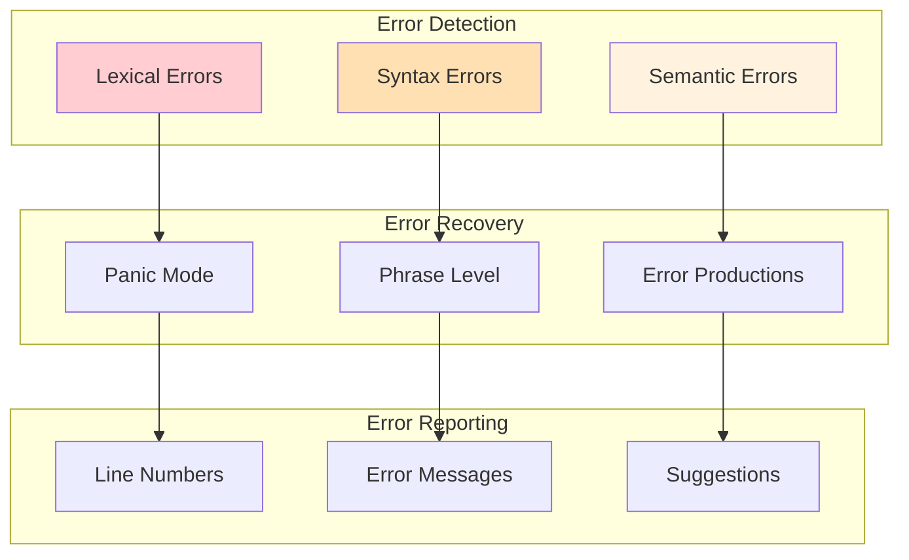

# HumanScript Compiler

**Advanced lexical and syntactic analysis system for custom programming language compilation**

## Overview

A comprehensive compiler implementation for the HumanScript programming language, featuring sophisticated lexical analysis, symbol table management, and syntactic parsing. This project delivers a complete compilation pipeline with optimized data structures and error handling mechanisms through cutting-edge compiler design principles.

## Core Components



| **Lexical Analysis** | **Syntax Analysis** | **Symbol Management** | **Error Handling** |
|:---:|:---:|:---:|:---:|
| `lexical.l` | `syntaxique.y` | `tableSymboles.c` | `analyse_syntaxique.c` |
| Token detection | Grammar validation | Hash table storage | Comprehensive reporting |
| Flex-based scanner | Bison-generated parser | O(1) symbol lookup | Detailed error messages |
| Pattern matching | AST generation | Scope management | Recovery mechanisms |

## Technology Stack


## System Architecture



## Installation & Setup

### Prerequisites

```bash
# Install required tools on Ubuntu/Debian
sudo apt update
sudo apt install flex bison gcc make

# For WSL users
wsl --install -d Ubuntu
```

### Quick Start

```bash
# Clone the repository
git clone https://github.com/yourusername/humanscript-compiler.git
cd humanscript-compiler

# Build the complete compiler
make all

# Or follow manual compilation steps below
```

## Compilation Pipeline

### Automated Build Process

```bash
# Complete build using Makefile
make clean      # Clean previous builds
make all        # Build all components
make test       # Run test suite
```

### Manual Compilation Steps



#### Step-by-Step Instructions

1. **Activate Linux Environment**:
   ```bash
   wsl  # Windows Subsystem for Linux
   ```

2. **Generate Lexical Analyzer**:
   ```bash
   flex lexical.l
   # Generates: lex.yy.c (scanner implementation)
   ```

3. **Generate Syntax Analyzer**:
   ```bash
   bison -d syntaxique.y
   # Generates: syntaxique.tab.c, syntaxique.tab.h (parser implementation)
   ```

4. **Compile Main Compiler**:
   ```bash
   gcc lex.yy.c syntaxique.tab.c -o compiler
   # Creates: compiler executable
   ```

5. **Execute Compiler**:
   ```bash
   ./compiler
   # Runs the complete compilation pipeline
   ```

6. **Build Syntax Analysis Tool**:
   ```bash
   gcc analyse_syntaxique.c tableSymboles.c -o analyse_syntaxique
   # Creates: analyse_syntaxique executable
   ```

7. **Run Syntax Analysis**:
   ```bash
   ./analyse_syntaxique
   # Executes detailed syntax analysis
   ```

## Language Features

### HumanScript Token Categories




## Performance Optimization


### Performance Metrics

| **Component** | **Time Complexity** | **Space Complexity** | **Optimization** |
|:---:|:---:|:---:|:---:|
| **Lexical Analysis** | O(n) | O(1) | Pattern matching optimization |
| **Symbol Lookup** | O(1) avg | O(n) | Hash table with chaining |
| **Syntax Parsing** | O(n) | O(h) | LR parsing with stack |
| **Error Recovery** | O(1) | O(1) | Panic mode recovery |


## Error Handling



## Testing & Validation

### Test Suite

```bash
# Run comprehensive tests
make test

# Individual component testing
./test_lexical.sh      # Lexical analysis tests
./test_syntax.sh       # Syntax analysis tests
./test_symbols.sh      # Symbol table tests
```

### Example Programs

```humanscript
// Sample HumanScript program
function main() {
    int x = 10;
    float y = 3.14;
    string message = "Hello, World!";
    
    if (x > 5) {
        print(message);
    }
    
    return 0;
}
```

## Contact

**Academic Project - Systems and Software Engineering**

**Institution:** Higher Scholl Of Computer Science Algiers
**Academic Year:** 2024/2025  
**Contact:** ly_dinari@esi.dz

## Contributing

```bash
# Fork the repository
git clone https://github.com/yourusername/humanscript-compiler.git

# Create feature branch
git checkout -b feature/improvement-name

# Make changes and commit
git commit -m "Add: description of changes"

# Push and create pull request
git push origin feature/improvement-name
```

## Acknowledgments

**Built with industry-standard tools:**
- **[GNU Flex](https://github.com/westes/flex)** - Fast lexical analyzer generator
- **[GNU Bison](https://www.gnu.org/software/bison/)** - Parser generator
- **[GCC](https://gcc.gnu.org/)** - GNU Compiler Collection
- **[Linux](https://www.linux.org/)** - Development environment
- **[Make](https://www.gnu.org/software/make/)** - Build automation tool

---
